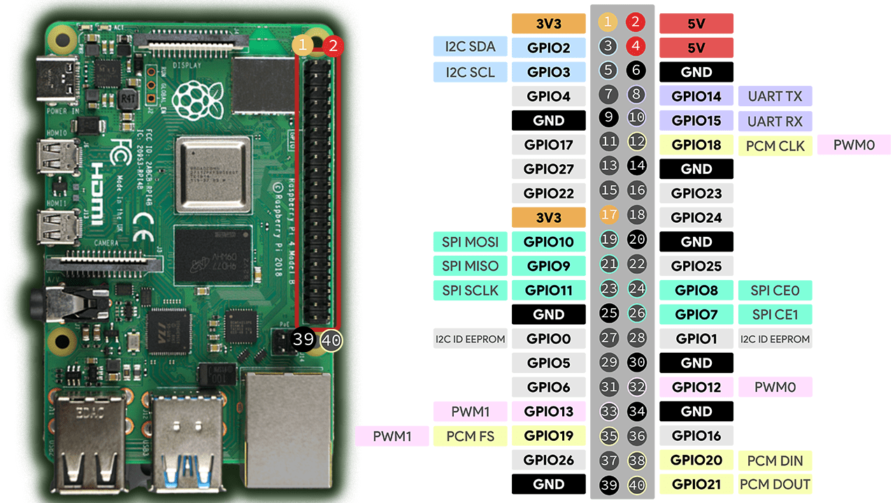

# Raspberry Pi 4B GPIO Pinout

## Pin Layout

The Raspberry Pi 4B has a 40-pin GPIO header. Pins are numbered 1-40, with odd numbers on the left and even numbers on the right when the Pi is oriented with the USB ports facing down.

| Left Side |     | Right Side |     |
|-----------|-----|------------|-----|
| 3.3V      | 1   | 2          | 5V  |
| GPIO 2 (SDA1) | 3 | 4        | 5V  |
| GPIO 3 (SCL1) | 5 | 6        | GND |
| GPIO 4    | 7   | 8          | GPIO 14 (TXD) |
| GND       | 9   | 10         | GPIO 15 (RXD) |
| GPIO 17   | 11  | 12         | GPIO 18 (PCM CLK / PWM0) |
| GPIO 27   | 13  | 14         | GND |
| GPIO 22   | 15  | 16         | GPIO 23 |
| 3.3V      | 17  | 18         | GPIO 24 |
| GPIO 10 (MOSI) | 19 | 20     | GND |
| GPIO 9 (MISO) | 21 | 22      | GPIO 25 |
| GPIO 11 (SCLK) | 23 | 24     | GPIO 8 (CE0) |
| GND       | 25  | 26         | GPIO 7 (CE1) |
| GPIO 0 (ID_SD) | 27 | 28     | GPIO 1 (ID_SC) |
| GPIO 5    | 29  | 30         | GND |
| GPIO 6    | 31  | 32         | GPIO 12 (PWM0) |
| GPIO 13 (PWM1) | 33 | 34     | GND |
| GPIO 19 (PCM FS / PWM1) | 35 | 36   | GPIO 16 |
| GPIO 26   | 37  | 38         | GPIO 20 (PCM DIN) |
| GND       | 39  | 40         | GPIO 21 (PCM DOUT) |

## Pin Types

### Power Pins

| Pin(s) | Type | Description |
|--------|------|-------------|
| 1, 17 | 3.3V | 3.3V power output. Max ~50mA total across both pins. Used for low-power logic and sensors. |
| 2, 4 | 5V | 5V power output directly from the Pi's power input. Can supply several hundred mA depending on your power supply. |
| 6, 9, 14, 20, 25, 30, 34, 39 | GND | Ground reference. Use these for completing circuits. |

### General Purpose I/O (GPIO)

All GPIO pins operate at 3.3V logic levels. They can source/sink up to ~16mA per pin, with a total limit of ~50mA across all pins.

| Feature | Description |
|---------|-------------|
| Digital Input | Read HIGH (3.3V) or LOW (0V) states |
| Digital Output | Set HIGH (3.3V) or LOW (0V) states |
| Internal Pull-up/Pull-down | Software-configurable internal resistors (~50K ohm) |

### Special Function Pins

Many GPIO pins have alternate functions that can be enabled:

#### I2C (Inter-Integrated Circuit)

| Pin | GPIO | Function | Description |
|-----|------|----------|-------------|
| 3 | GPIO 2 | SDA1 | I2C data line |
| 5 | GPIO 3 | SCL1 | I2C clock line |

Used for communicating with sensors, displays, ADCs, and other I2C peripherals. Directly connected to 1.8K pull-up resistors on the Pi.

#### SPI (Serial Peripheral Interface)

| Pin | GPIO | Function | Description |
|-----|------|----------|-------------|
| 19 | GPIO 10 | MOSI | Master Out, Slave In (data to peripheral) |
| 21 | GPIO 9 | MISO | Master In, Slave Out (data from peripheral) |
| 23 | GPIO 11 | SCLK | Serial clock |
| 24 | GPIO 8 | CE0 | Chip Enable 0 (device select) |
| 26 | GPIO 7 | CE1 | Chip Enable 1 (device select) |

Used for high-speed communication with displays, SD cards, and other SPI peripherals.

#### UART (Serial)

| Pin | GPIO | Function | Description |
|-----|------|----------|-------------|
| 8 | GPIO 14 | TXD | Transmit data |
| 10 | GPIO 15 | RXD | Receive data |

Used for serial communication with GPS modules, other microcontrollers, or serial console access.

#### PWM (Pulse Width Modulation)

| Pin | GPIO | Function | Description |
|-----|------|----------|-------------|
| 12 | GPIO 18 | PWM0 | Hardware PWM channel 0 (alternate pin) |
| 32 | GPIO 12 | PWM0 | Hardware PWM channel 0 |
| 33 | GPIO 13 | PWM1 | Hardware PWM channel 1 |
| 35 | GPIO 19 | PWM1 | Hardware PWM channel 1 (alternate pin) |

The Pi has two hardware PWM channels (PWM0 and PWM1), but each channel can be routed to multiple pins. GPIO 12 and GPIO 18 share PWM0; GPIO 13 and GPIO 19 share PWM1. Only one pin per channel can be active at a time.

Hardware PWM provides precise timing for motor control, LED dimming, and servo control. Software PWM is available on any GPIO pin but is less precise.

#### PCM (Pulse Code Modulation) / I2S

| Pin | GPIO | Function | Description |
|-----|------|----------|-------------|
| 12 | GPIO 18 | PCM CLK | Bit clock |
| 35 | GPIO 19 | PCM FS | Frame sync (left/right clock) |
| 38 | GPIO 20 | PCM DIN | Data input |
| 40 | GPIO 21 | PCM DOUT | Data output |

Used for digital audio interfaces with DACs, ADCs, and audio codecs.

#### ID EEPROM

| Pin | GPIO | Function | Description |
|-----|------|----------|-------------|
| 27 | GPIO 0 | ID_SD | EEPROM data |
| 28 | GPIO 1 | ID_SC | EEPROM clock |

Reserved for HAT (Hardware Attached on Top) identification. These pins communicate with an EEPROM on official Pi HATs to auto-configure the system. Avoid using these for general I/O.

## Pins Used in This Project

For the BTS7960 motor driver control:

| Pin | GPIO | Purpose |
|-----|------|---------|
| 11 | GPIO 17 | RPWM - Extend actuator |
| 13 | GPIO 27 | LPWM - Retract actuator |
| 14 | GND | Common ground with BTS7960 |

## Important Notes

### Voltage Levels
- GPIO pins are **3.3V only**. Connecting 5V directly to a GPIO pin will damage the Pi.
- Use a level shifter or voltage divider when interfacing with 5V logic devices.

### Current Limits
- Individual GPIO: ~16mA max
- Total across all GPIO: ~50mA max
- 3.3V rail: ~50mA max
- 5V rail: Limited by your power supply minus what the Pi itself uses

### Pin Numbering Schemes
There are two common numbering schemes:
- **Physical/Board**: Pin numbers 1-40 as printed on the board
- **BCM (Broadcom)**: GPIO numbers used by the chip (e.g., GPIO 17)

gpiozero uses BCM numbering by default, so `GPIO 17` means physical pin 11.
